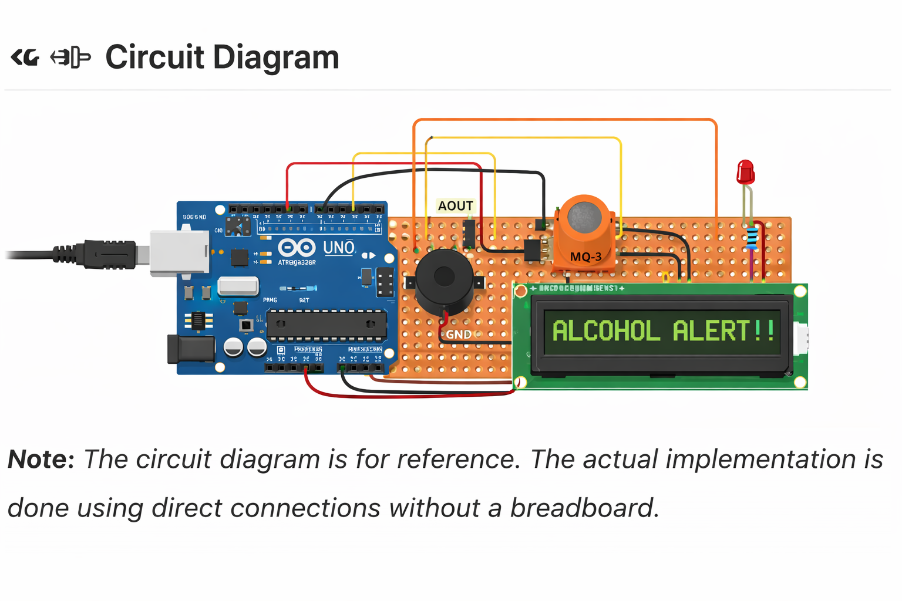

🚨 Alcohol Detection and Alert System using MQ-3 and Arduino

## 📖 Project Overview
The Alcohol Detection and Alert System is an embedded system designed using Arduino and MQ-3 gas sensor to detect the presence of alcohol in the surrounding environment. The system continuously monitors alcohol concentration levels and provides real-time alerts through an LCD display, buzzer, and LED.

This project is mainly developed for safety applications such as preventing drunk driving, industrial monitoring, and personal safety systems. The system is capable of identifying alcohol vapor and triggering alerts when the concentration exceeds a predefined threshold level.

---

## 🎯 Objectives
- To design a real-time alcohol detection system
- To monitor alcohol concentration using MQ-3 sensor
- To display real-time data on LCD screen
- To generate audio and visual alerts when alcohol is detected
- To implement a reliable and low-cost embedded safety solution

---

## 🧠 Working Principle
The MQ-3 sensor is a semiconductor-based gas sensor that detects alcohol vapor present in the air. It produces an analog output voltage proportional to the concentration of alcohol.

This analog signal is given to the Arduino through the analog input pin (A0). The Arduino reads this value using the `analogRead()` function and compares it with a predefined threshold value.

- If the sensor value is below threshold → System remains in SAFE state  
- If the sensor value exceeds threshold → Alcohol is DETECTED  

When alcohol is detected:
- Buzzer is activated (audio alert)
- LED glows (visual alert)
- LCD displays warning message  

---

## ⚙️ Components Used
- Arduino Uno / Nano
- MQ-3 Alcohol Sensor
- 16x2 LCD Display (I2C)
- Buzzer
- LED
- Resistors (220Ω)
- Jumper Wires
- Power Supply

---

## 🔌 Circuit Connections

### MQ-3 Sensor
- VCC → 5V  
- GND → GND  
- AOUT → A0  

### LCD (I2C)
- SDA → A4 (Arduino Uno)  
- SCL → A5 (Arduino Uno)  

### Buzzer
- Connected to Digital Pin 9  

### LED
- Connected to Digital Pin 8 (with resistor)

---

## 🛠️ Hardware Implementation
The system is implemented using direct wiring instead of a breadboard. This approach improves the stability, reliability, and durability of the system, making it suitable for real-world applications.

---

## 💻 Software Used
- Arduino IDE
- Embedded C Programming
- Serial Monitor (for debugging)

---

## ▶️ Installation and Setup
1. Connect all components as per the circuit connections
2. Install required libraries (LiquidCrystal_I2C)
3. Upload the code using Arduino IDE
4. Power ON the system
5. Monitor readings using Serial Monitor
6. Test by exposing sensor to alcohol

---

## 🔍 Code Logic
- Read sensor value using `analogRead()`
- Convert analog value to voltage (optional)
- Compare value with threshold
- If value > threshold:
  - Activate buzzer and LED
  - Display "ALCOHOL DETECTED" on LCD
- Else:
  - Keep system in safe state

---

## 🚀 Features
- Real-time alcohol detection
- LCD display for monitoring
- Audio and visual alert system
- Simple and cost-effective design
- Easy to use and implement

---

## 📸 Output

---

## 🛠️ Applications
- 🚗 Vehicle Ignition Interlock System (prevents drunk driving)
- 🧑‍🏭 Industrial Safety Monitoring
- 🧪 Educational Demonstrations
- 🛡️ Personal Safety Device
- 🚓 Traffic and Law Enforcement Systems

---

## 🔮 Future Scope
- Integration with IoT for remote monitoring
- GSM module for SMS alerts
- GPS tracking system
- Mobile application integration
- Cloud data storage and analytics

---

## ⚠️ Limitations
- Requires proper calibration
- Sensitive to other gases
- Accuracy depends on environmental conditions

---

## 👨‍💻 Author
**Ajay Sonawane**  
Electronics & Telecommunication Engineer  
Interested in IoT, Embedded Systems, and Automation

---

## 📌 Note
This project is developed for educational and demonstration purposes.
